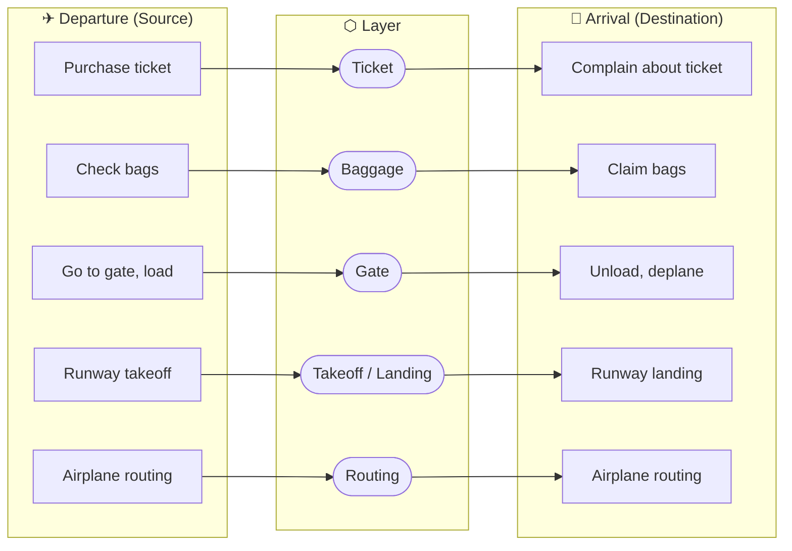

# 1.5 Protocol Layers and Their Service Models

> **One-Line Summary:** The Internet manages its enormous complexity by organizing protocols into layers — each layer provides a service to the layer above by performing actions within itself and using services of the layer below; data travels down the stack at the source (adding headers at each layer) and back up at the destination (removing them).

---

## Why Layering? — The Complexity Problem

The Internet is an extremely complicated system:

- Numerous applications and protocols
- Many types of end systems
- Packet switches of different kinds
- Various link-level media

Without structure, describing, designing, or updating such a system would be impossible. **Layering** is the solution — it gives us modularity, making it easy to update one component without breaking the rest.

---

# 1.5.1 Layered Architecture

## The Airline Analogy

Before diving into network layers, consider how an **airline system** works. When you fly, a series of actions happen in order at each end:

![[Pasted image 20260619141609.png]] _(Figure 1.22 — Taking an airplane trip: each action at departure has a mirror action at arrival)_

_(Figure 1.23 — Horizontal layering of airline functionality: departure airport → intermediate air-traffic control → arrival airport)_

**Key observations from the airline analogy:**

- Each layer **provides a service** to the layer above it.
- Each layer uses the **services of the layer directly below** it.
- You can only board at the gate layer if you are already ticketed AND baggage-checked — each layer builds on the layers below. (This is also why looking at the functionality "horizontally" — ticketing-to-ticketing, baggage-to-baggage, gate-to-gate, and so on — reveals the layered structure in the first place.)
- **Intermediate nodes** (air traffic control) only implement the **routing layer** — not ticketing or baggage. This maps exactly to how routers only implement the lower network layers.

---

## Why Layering Is Powerful — Modularity

> A layered architecture allows us to discuss a **well-defined, specific part** of a large and complex system.

**The core rule of layering:**

- As long as a layer provides the **same service** to the layer above,
- And uses the **same services** from the layer below,
- The rest of the system **remains unchanged** when that layer's implementation is changed.

> Changing the **implementation** of a service is very different from changing the **service** itself.

**Example:** If the gate layer changed its boarding procedure (height-based instead of seat number), the rest of the airline system is completely unaffected — the gate still does the same job: load and unload people. It simply implements that function in a different manner after the change.

**Applied to networking:**

- HTTP can change from 1.1 to 2.0 without changing TCP.
- TCP can be swapped without changing IP.
- Ethernet can be replaced with WiFi without changing IP.
- Each layer is independently upgradeable.

> For large and complex systems that are constantly being updated, the ability to change the implementation of a service **without affecting other components** is the critical advantage of layering.

---

## Protocol Layering

Network designers organize protocols — and the hardware/software that implements them — **into layers**.

Each layer:

1. **Performs certain actions within itself**
2. **Uses services of the layer directly below it**

The services a layer offers to the layer above = its **service model**.

**How layers provide better services than the one below:** Layer n may provide **reliable delivery** by using an **unreliable** delivery service from layer n-1, and adding error-detection and retransmission logic at layer n.

**Where layers live physically:**

|Layer|Implemented In|
|---|---|
|Application|Software in end systems|
|Transport|Software in end systems|
|Network|Mixed hardware + software|
|Link|Network interface cards (Ethernet NIC, WiFi card)|
|Physical|Hardware + physical medium|

Just as the functions in the layered airline architecture were distributed among the various airports and flight-control centers, a layer-n protocol is distributed among the end systems, packet switches, and other components that make up the network — there's often a piece of a layer-n protocol living in each of these components.

---

### Advantages and Drawbacks of Layering

Layering isn't a free lunch — it has real benefits, but it also has critics among networking researchers and engineers.

**Advantages (RFC 3439):**

- Provides a **structured way** to discuss system components.
- **Modularity** makes it much easier to update individual components (as covered above).

**Drawbacks (some researchers/engineers are opposed to layering — Wakeman 1992):**

1. **Functional duplication** — one layer may duplicate functionality that's already provided by a layer below it. For example, many protocol stacks implement error recovery both on a **per-link basis** (at the link layer) and on an **end-to-end basis** (at the transport layer) — which is redundant work.
2. **Layer-violating information needs** — functionality at one layer may need information (for example, a **timestamp value**) that is present only at another layer. Needing to pass that information across layer boundaries **violates the goal of strict separation of layers**.

> Despite these critiques, layering remains the dominant way the Internet is organized — in practice, the benefits of modularity generally outweigh the costs.

---

# The Internet Protocol Stack — Five Layers

When taken together, the protocols of the various layers are called the **protocol stack**. The Internet protocol stack consists of exactly five layers — physical, link, network, transport, and application — as shown below. This material (and these notes) follows a **top-down approach**: starting at the application layer and working down to the physical layer.

![[Pasted image 20260619141905.png]] _(Figure 1.24 — (a) Five-layer Internet protocol stack vs (b) Seven-layer OSI reference model)_

|Layer|Protocols|PDU|
|---|---|---|
|Application|HTTP, SMTP, FTP, DNS|Message|
|Transport|TCP, UDP|Segment|
|Network|IP, Routing protocols|Datagram|
|Link|Ethernet, WiFi, PPP|Frame|
|Physical|Bits on the wire|Bits|

---

## Layer 5 — Application Layer

**What it does:** Where network **applications** and their protocols live. This is the only layer the end user directly interacts with.

**Key protocols:**

|Protocol|Purpose|
|---|---|
|**HTTP**|Web document request and transfer|
|**SMTP**|Transfer of email messages between mail servers|
|**FTP**|Transfer of files between end systems|
|**DNS**|Translates names (www.google.com) → 32-bit IP addresses|

**Key characteristics:**

- Protocols are **distributed over multiple end systems**.
- Application in one end system uses protocol to exchange packets with application in another end system.
- Very easy to create new application-layer protocols — Chapter 2 shows how.

> **Packet name: MESSAGE**

---

## Layer 4 — Transport Layer

**What it does:** Transports **application-layer messages** between application endpoints on source and destination hosts.

**Two protocols:**

|Feature|TCP|UDP|
|---|---|---|
|Connection|Connection-oriented|Connectionless|
|Delivery|Guaranteed|No guarantee|
|Flow control|Yes (speed matching)|No|
|Congestion ctrl|Yes (throttles sender)|No|
|Overhead|Higher (reliable)|Low (simple)|
|Best for|Web, email, file transfer|VoIP, gaming, DNS|

> **Packet name: SEGMENT**

---

## Layer 3 — Network Layer

**What it does:** Moves **datagrams** from one host to another across the entire Internet. Transport layer passes a segment + destination address to the network layer — like giving a letter with an address to the postal service.

**Key protocols:**

|Protocol|Purpose|
|---|---|
|**IP**|Defines datagram fields; how routers and end systems act on them|
|**Routing protocols**|Determine routes datagrams take source → destination|

> **IP is the glue that binds the Internet together.** There is only ONE IP protocol. Every Internet component with a network layer MUST run IP. The network layer is often just called the **"IP layer"**.

> **Packet name: DATAGRAM**

---

## Layer 2 — Link Layer

**What it does:** Moves a datagram from one **node to the next node** along the route (not end-to-end — that's the network layer's job). At each node, the network layer passes the datagram DOWN to the link layer, which delivers it to the NEXT node, then passes it back UP to the network layer.

**Key characteristics:**

- Services depend on the **specific link-layer protocol** used on that link.
- Some provide **reliable delivery** over a single link (different from TCP's end-to-end reliability).
- A datagram may use **different link-layer protocols** on different links along its path (Ethernet on one, WiFi on the next, PPP on the next).

**Link-layer protocol examples:**

- **Ethernet** — wired LAN
- **WiFi (802.11)** — wireless LAN
- **DOCSIS** — cable access networks
- **PPP** — point-to-point links

> **Packet name: FRAME**

---

## Layer 1 — Physical Layer

**What it does:** While the link layer moves entire **frames** between adjacent network elements, the physical layer moves **individual bits** within a frame from one node to the next.

**Key characteristics:**

- Protocols are link-dependent AND medium-dependent.
- Ethernet has multiple physical-layer protocols:

|Medium|Physical-Layer Protocol|
|---|---|
|Twisted-pair copper|100BASE-TX, 1000BASE-T|
|Coaxial cable|DOCSIS, 10BASE2|
|Optical fiber|1000BASE-LX, 100BASE-FX|

Each moves a bit differently depending on the medium.

> **Packet name: BITS (no packet — individual bits)**

---

## All Five Layers — Master Summary

|#|Layer|Packet Name|Key Protocols|Device|
|---|---|---|---|---|
|5|Application|Message|HTTP, SMTP, FTP, DNS|End systems|
|4|Transport|Segment|TCP, UDP|End systems|
|3|Network|Datagram|IP, routing protocols|End systems + Routers|
|2|Link|Frame|Ethernet, WiFi, DOCSIS|End systems + Routers + Switches|
|1|Physical|Bits|Medium-specific|All nodes|

---

# The OSI Model — Seven Layers

In the late 1970s, the **International Organization for Standardization (ISO)** proposed a seven-layer model called the **Open Systems Interconnection (OSI)** model — developed when Internet protocols were still in their infancy.

|#|Layer|Function|vs Internet Model|
|---|---|---|---|
|7|Application|User-facing protocols (HTTP, FTP, DNS)|Same as Application layer|
|6|Presentation|Compression, encryption, data formatting|⭐ Extra layer|
|5|Session|Synchronization, checkpointing, recovery|⭐ Extra layer|
|4|Transport|TCP/UDP, end-to-end delivery|Same as Transport layer|
|3|Network|IP, routing|Same as Network layer|
|2|Data Link|Ethernet, WiFi, framing|Same as Link layer|
|1|Physical|Bits on the wire|Same as Physical layer|
|**The two extra OSI layers (not in Internet stack):**||||

|OSI Layer|Role|Internet's Answer|
|---|---|---|
|**Presentation (6)**|Data compression, encryption, description — lets apps interpret the meaning of data|Left to the application developer|
|**Session (5)**|Delimiting and synchronization of data exchange; checkpointing and recovery scheme|Left to the application developer|

**Why the Internet skips these two layers:** The Internet's answer: **it's up to the application developer**. If a service is important, build it into the application itself. This is the **end-to-end argument** — keep the core simple, push complexity to the edges.

**Internet stack vs OSI — Layer Mapping:**

|Internet Layer|OSI Layer(s)|Notes|
|---|---|---|
|Application (5)|App (7) + Presentation (6) + Session (5)|Internet collapses 3 OSI layers into 1|
|Transport (4)|Transport (4)|Same|
|Network (3)|Network (3)|Same|
|Link (2)|Data Link (2)|Same|
|Physical (1)|Physical (1)|Same|

**Historical note:**

- OSI was heavily taught in the 1980s–90s — many textbooks still use it.
- The 5-layer Internet stack is what the actual Internet runs on.
- Kurose & Ross uses the 5-layer Internet stack (top-down approach).

---

# 1.5.2 Encapsulation

## The Physical Path Data Takes

![[Pasted image 20260619142143.png]] _(Figure 1.25 — Hosts, routers, and link-layer switches; each contains a different set of layers, reflecting their differences in functionality — data goes down the stack at the source, through intermediate nodes, and back up at the destination)_

**Which layers each device implements:**

|Layer|End System (Source)|Link Layer|Router|End System (Destination)|
|---|---|---|---|---|
|Application|✅|||✅|
|Transport|✅|||✅|
|Network|✅||✅|✅|
|Link|✅|✅|✅|✅|
|Physical|✅|✅|✅|✅|

> **Architecture principle:** Routers are simple (layers 1-3 only). End systems are complex (all 5 layers). **Complexity lives at the edges — the core stays lean.**

Link-layer switches implement only layers 1–2; routers implement layers 1–3. That means routers can run the IP protocol (a layer-3 protocol), while link-layer switches cannot — switches don't recognize IP addresses at all, only layer-2 addresses (like Ethernet/MAC addresses). Hosts, by contrast, implement all five layers — consistent with the broader view that the Internet architecture pushes most of its complexity out to the edges of the network.

---

## Step-by-Step Encapsulation — Source Side

Data travels **DOWN** the stack at the source, with each layer adding its own header:

|Layer|PDU|Structure|Action|
|---|---|---|---|
|Application|Message|`M`|Original message created|
|Transport|Segment|`Ht · M`|Transport header added|
|Network|Datagram|`Hn · Ht · M`|Network header added|
|Link|Frame|`Hl · Hn · Ht · M`|Link header added|
|Physical|Bits|`0 1 0 1 1 0 0 1 ...`|Converted to bits on the wire|
|**What each header contains:**||||

|Header|Layer|Contains|
|---|---|---|
|H_t|Transport|Destination port, sequence number, error-detection bits|
|H_n|Network|Source IP, destination IP, protocol type|
|H_l|Link|Source MAC, destination MAC, frame type|

---

## Through Intermediate Nodes

**At a link-layer switch (implements layers 1-2 only):**

|Step|Action|Result|
|---|---|---|
|1|Receive bits|`0 1 0 1 1 0 ...`|
|2|Assemble frame|`Hl · Hn · Ht · M`|
|3|Read `Hl`|Finds next node's MAC address|
|4|Strip `Hl`|`Hn · Ht · M`|
|5|Add new `Hl`|`Hl_new · Hn · Ht · M`|
|6|Send as bits|`0 1 1 0 0 1 ...`|
|The switch **never sees** H_n (IP), H_t (TCP), or M (data).|||
|This is why switches **cannot recognize IP addresses**.|||

**At a router (implements layers 1-3 only):**

|Step|Action|Result|
|---|---|---|
|1|Receive bits|`0 1 0 1 1 0 ...`|
|2|Assemble frame|`Hl · Hn · Ht · M`|
|3|Strip `Hl`|`Hn · Ht · M`|
|4|Read `Hn`|Looks up destination IP in forwarding table|
|5|Keep `Hn`|`Hn · Ht · M` (network header stays intact)|
|6|Add new `Hl`|`Hl_new · Hn · Ht · M`|
|7|Send as bits|`0 1 1 0 0 1 ...`|
|The router **never sees** H_t (TCP/UDP) or M (application data).|||
|This is why basic routers **cannot do application-layer filtering**|||
|(firewalls can, because they are special routers with extra logic).|||

---

## De-encapsulation — Destination Side

Data travels **UP** the stack at the destination, with each layer stripping its header:

|Layer|Receives|Action|Passes Up|
|---|---|---|---|
|Physical|`0 1 0 1 1 0 ...`|Reassemble|`Hl · Hn · Ht · M`|
|Link|`Hl · Hn · Ht · M`|Strip `Hl`|`Hn · Ht · M`|
|Network|`Hn · Ht · M`|Strip `Hn`|`Ht · M`|
|Transport|`Ht · M`|Strip `Ht`|`M`|
|Application|`M`|✅ Deliver|—|

---

## The Postal Analogy for Encapsulation

> Alice (branch office A) wants to send a memo to Bob (branch office B).

|Step|Real World|Network Equivalent|PDU|
|---|---|---|---|
|1|Alice writes memo|Message created|`M`|
|2|Memo placed in interoffice envelope|Transport header added|`Ht · M`|
|3|Interoffice env placed in postal env|Network header added|`Hn · Ht · M`|
|4|Postal service delivers|Link/Physical transmission|`Hl · Hn · Ht · M`|

|Step|Real World|Network Equivalent|Remaining Data|
|---|---|---|---|
|5|Mailroom strips postal envelope|Link layer strips `Hl`|`Hn · Ht · M`|
|6|Mailroom forwards interoffice env|Network layer strips `Hn`|`Ht · M`|
|7|Bob strips interoffice envelope|Transport layer strips `Ht`|`M`|
|8|Bob reads memo|Application receives message|✅ `M` delivered|

**Key insight:** The postal service (routers) sees only the **outer envelope** (datagram). It never opens the envelope to read what's inside. This is exactly why routers only look at IP headers — they never inspect the payload.

---

## Encapsulation Can Get More Complex

The clean one-message → one-segment → one-datagram → one-frame picture above is the _simplest_ case. In practice it can get more involved:

- A large application-layer message may be **divided into multiple transport-layer segments** (rather than fitting into just one).
- Each of those segments might itself be **divided into multiple network-layer datagrams**.
- At the receiving end, a transport-layer segment must then be **reconstructed from its constituent datagrams** before it can be passed back up to the application layer.

This is part of _why_ TCP carries sequence numbers in the first place — they're what lets the receiver reassemble the original segments (and the datagrams that carried them) in the correct order.

---

## Encapsulation — Complete Picture

|Layer|Source Host|Switch|Router|Destination Host|
|---|---|---|---|---|
|Application|`M`|||`M`|
|Transport|`Ht · M`|||`Ht · M`|
|Network|`Hn · Ht · M`||✅|`Hn · Ht · M`|
|Link|`Hl · Hn · Ht · M`|✅|✅|`Hl · Hn · Ht · M`|
|Physical|`bits`|✅|✅|`bits`|

|Device|Layers Processed|Role|
|---|---|---|
|Source Host|L1 → L7|Full encapsulation, all layers|
|Switch|L1 – L2|Forwards frames by MAC address|
|Router|L1 – L3|Forwards packets by IP address|
|Destination Host|L7 → L1|Full decapsulation, all layers|

---

# Why It Matters for Security

|Concept|Attacker's Perspective|Defender's Perspective|
|---|---|---|
|**Encapsulation**|Hide malicious payload inside normal-looking headers — routers only see IP header, never the payload|Deep Packet Inspection (DPI) — inspect inside payload to detect malicious content|
|**Routers see only layer 3**|Malicious application-layer content passes through routers unchecked|Firewalls at boundaries inspect application layer|
|**Switches see only layer 2**|ARP spoofing — poison link-layer MAC address tables to redirect traffic|ARP inspection, MAC address filtering|
|**Layer independence**|Attack one layer invisibly from another — IP spoofing (layer 3) is invisible at layer 2|Each layer independently validates inputs|
|**No presentation layer**|No standard encryption in Internet stack — apps implement it themselves, often poorly|TLS/SSL implemented at application layer fills this gap|
|**No session layer**|No standard session management — apps implement it themselves|Session tokens, JWT, secure cookies must be carefully designed by the developer|

---

## Questions I Still Have

- [ ] If routers only implement layers 1-3, how do firewalls do deep packet inspection at layer 7? Are they special-purpose routers?
- [ ] How does a link-layer switch learn MAC addresses — is there a protocol for building the MAC address table?
- [x] When TCP splits a large message into multiple segments, how does the receiver know how to reassemble them in the correct order? — _Partially answered above ("Encapsulation Can Get More Complex"): a message can be split across multiple segments and those segments across multiple datagrams; TCP's sequence numbers are what let the receiver put everything back in order. The full reassembly mechanics (buffers, ACKs) belong to the Transport Layer chapter._
- [ ] TLS/SSL provides encryption at the application layer. Does it sit between the application and transport layers conceptually?
- [ ] If a datagram travels through 10 routers, does H_n (IP header) stay completely the same at every hop, or does anything change?

---

## Key Terms — Quick Reference

|Term|Definition|
|---|---|
|**Protocol stack**|Complete set of protocols at all layers of a network architecture|
|**Service model**|The services a layer offers to the layer directly above it|
|**Layering**|Organizing protocols hierarchically where each layer serves the one above|
|**Modularity**|Ability to change one layer's implementation without affecting other layers|
|**Functional duplication**|A drawback of layering — the same job (e.g., error recovery) gets redone at more than one layer|
|**Message**|Application-layer packet name|
|**Segment**|Transport-layer packet name|
|**Datagram**|Network-layer packet name|
|**Frame**|Link-layer packet name|
|**Encapsulation**|Adding a header at each layer as data travels DOWN the stack|
|**De-encapsulation**|Stripping headers at each layer as data travels UP the stack|
|**Header**|Control info added by a layer; used by the peer layer at the destination|
|**Payload**|The packet from the layer above, carried inside the current layer's packet|
|**OSI model**|7-layer reference model — adds Presentation and Session vs Internet stack|
|**Presentation layer**|OSI layer for compression, encryption, data description|
|**Session layer**|OSI layer for synchronization, checkpointing, recovery|
|**End-to-end argument**|Keep network core simple; push complexity to end systems|

---

## Related Concepts

---

→ Next: [[NETWORKS UNDER ATTACK]]